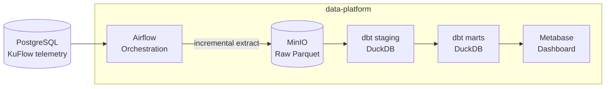

<div align="center">

# 🧱 data-platform

**Production-grade Data Lakehouse Platform for Telemetry Analytics**

[](https://airflow.apache.org)
[](https://www.getdbt.com)
[](https://min.io)
[](https://www.metabase.com)
[](https://www.docker.com)
[](#current-status)

[Overview](#overview) •
[Architecture](#architecture) •
[Tech Stack](#technology-stack) •
[Structure](#project-structure) •
[Status](#current-status) •
[Author](#author)

</div>

---

## Overview

**data-platform** is an orchestrated data lakehouse platform: it automatically extracts telemetry data from a PostgreSQL source, archives it in an object store as columnar Parquet files, transforms it into validated analytical marts via dbt, and surfaces the result on a BI dashboard — without manual intervention.

The platform is designed to be **source-agnostic**: today it consumes telemetry produced by [KuFlow](https://github.com/Rowlyge/kuflow) (a reverse proxy) through a PostgreSQL database, but the extraction/transform/BI layers are built to work with any future data source.

|                          |                       |                          |
| ------------------------ | --------------------- | ------------------------ |
| 🌀 Workflow Orchestration | 🗄️ Object Storage     | 🔄 ELT Transformations   |
| 📊 BI & Dashboards       | 🐳 Docker Compose      | 🧪 Data Quality Testing  |

---

## Features

* 🌀 **Scheduled Extraction** — Airflow DAGs pull new telemetry from PostgreSQL on a schedule
* 🔐 **Secure Credentials** — source DB and object storage access via encrypted Airflow Connections, not hardcoded secrets
* 🗄️ **Raw Data Lake** — immutable Parquet archive in MinIO (S3-compatible), partitioned by date
* 🔄 **dbt + DuckDB Transformations** — staging and marts layers built directly on top of Parquet
* 🧪 **Data Quality Tests** — `not_null`, `unique`, `accepted_values`, and custom anomaly checks
* 📊 **Metabase Dashboard** — auto-refreshing visualizations on top of validated marts
* ♻️ **Idempotent Runs** — re-running a DAG for the same period never duplicates data
* 🐳 **One-Command Bootstrap** — the entire stack starts with `docker-compose up`

---

## Technology Stack

| Layer            | Technology                          |
| ----------------- | ------------------------------------ |
| Orchestration      | Apache Airflow                       |
| Object Storage     | MinIO (S3-compatible)                |
| File Format        | Parquet                              |
| Transformation      | dbt (`dbt-duckdb`)                   |
| Query Engine        | DuckDB                               |
| BI / Dashboard      | Metabase                             |
| Source Database     | PostgreSQL (external, from KuFlow)   |
| Containers          | Docker / Docker Compose              |
| Language            | Python                               |
| Version Control     | Git                                  |
| IDE                 | VS Code (WSL)                        |
| OS                  | Ubuntu (WSL/Linux)                   |

---

## Quick Start

Requirements: Docker and Docker Compose, and a running PostgreSQL instance with telemetry data (e.g. from KuFlow).

```bash
# 1. Clone the repository
git clone https://github.com/Rowlyge/data-platform.git
cd data-platform

# 2. Copy environment variables and fill in real values
cp .env.example .env

# 3. Start the stack
docker compose up -d

# 4. Verify services
docker compose ps
```

Services once running:

| Service   | URL                     | Default credentials     |
| --------- | ------------------------ | ------------------------ |
| Airflow   | http://localhost:8080     | from `.env`               |
| MinIO     | http://localhost:9001     | from `.env`               |
| Metabase  | http://localhost:3000     | set up on first visit     |

Stop everything:

```bash
docker compose down
```

---

## Project Structure

```text
data-platform/
│
├── dags/                                 # Airflow DAGs
│   ├── raw_extract_requests.py           # incremental extraction -> Parquet -> MinIO (Raw layer)
│   ├── incremental_extract_requests.py   # dev stub: validates interval-based filtering
│   ├── stub_extract_requests.py          # dev stub: Postgres connectivity check
│   └── stub_minio_roundtrip.py           # dev stub: MinIO connectivity check
│
├── dbt_project/                          # dbt models (staging, marts, tests)
│
├── docker/                               # supporting Docker configs
│
├── docker-compose.yml
├── .env.example
├── .gitignore
└── README.md
```

---

## Architecture



**Why three layers?**

* **Raw** — an immutable, as-is archive of extracted data. Nothing here is ever modified; it exists so any transformation bug can be fixed by re-running dbt against the same source data, without re-querying the original database.
* **Staging** — light cleanup: type casting, column renaming, deduplication. A 1:1 mirror of Raw, but analytics-ready.
* **Marts** — business-level aggregates (traffic over time, latency percentiles, error rates, per-upstream breakdowns) that Metabase queries directly.

**Pipeline flow:**

1. Airflow triggers an extraction DAG on a schedule.
2. The DAG connects to the source PostgreSQL (via an Airflow Connection) and pulls only rows within the current `data_interval`.
3. Extracted rows are written to MinIO as partitioned Parquet files (Raw layer), overwriting the file for that interval to guarantee idempotency.
4. dbt runs on top of the Parquet files via DuckDB, building staging and marts models with tests.
5. Metabase queries the marts layer and refreshes dashboards automatically.

---

## Current Status

**Currently implemented:**

* ✅ Docker Compose stack: Airflow, MinIO, Metabase, with restart policies to survive daemon restarts
* ✅ Network bridging between `data-platform` and the external KuFlow/PostgreSQL stack
* ✅ Source and MinIO credentials stored as encrypted Airflow Connections (no hardcoded secrets)
* ✅ MinIO bucket (`data-lake`) provisioned for the Raw layer
* ✅ Incremental extraction logic using Airflow's native `data_interval` (no separate checkpoint table needed)
* ✅ Extracted data written as partitioned Parquet files (`year=/month=/day=`) to MinIO
* ✅ Idempotent runs verified end-to-end: re-running the same interval overwrites the same file instead of duplicating it

**Next milestones:**

* [ ] dbt project initialization (staging + marts models) reading Parquet via DuckDB
* [ ] dbt tests for data quality (`not_null`, `unique`, `accepted_values`, anomaly checks)
* [ ] Metabase dashboard with core metrics (total requests, p95 latency, error rate, traffic by upstream)
* [ ] Retry policy and failure alerting for Airflow DAGs
* [ ] Real `@daily` scheduling in production (currently tested via `airflow tasks test` against historical intervals)

---

## Author

<table>
  <tr>
    <td align="center">
      <b>Michail Sokun</b>
    </td>
  </tr>
</table>

---

## License

This project is licensed under the terms of the MIT License.
